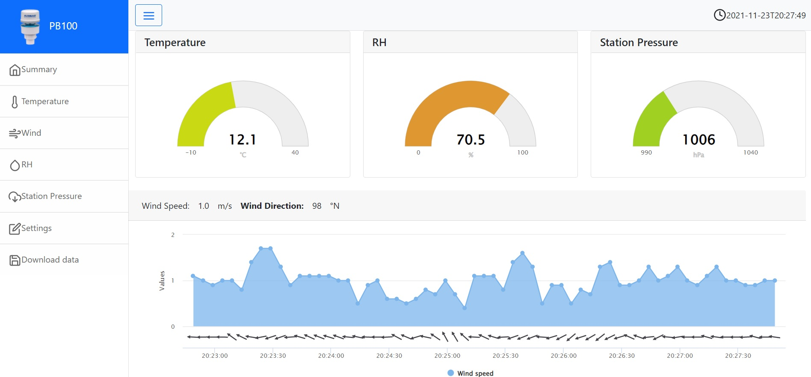

# pb100-Weather-Station
ESP8266 web interface for Airmar PB100

Weather station that reads RS485 / NMEA weather data from an Airmar PB100 sensor, and measures temperature using an LM34 temperature sensor

10 minute data is stored as a 24 hour rolling data cache, and also the previous 6 days of data as files in flash.

Data is viewable using a web browser, served web page feartures an HTML5 web app using Bootstrap and Highcharts to display the data, or altenatively another display can be utilise the simple REST API on the ESP8266 to obtain data. 

# Software Environment

Built with Arduino 1.8.13

Libraries:
 - ArduinoJson by Benoit Blanchon Version 6.18.5 (from IDE Libraries)
 - ESPAsyncWebServer by Me-No-Dev version 1.2.3 (https://github.com/me-no-dev/ESPAsyncWebServer)
 - NMEAParser by Glinnes Hulden Version 1.1.0 (from IDE libraries)
 - ESPAsyncTCP by Me-No-Dev version 1.2.2 (https://github.com/me-no-dev/ESPAsyncTCP)
 - AdafruitADS1X15 by Adafruit version 1.1.0 (https://github.com/adafruit/Adafruit_ADS1X15)
 - ESPSoftwareSerial by Dirk Kaar 6.12.7 (from IDE libraries)
 - Time by Michael Margolis Version 1. (http://playground.arduino.cc/code/time)

# Hardware 

Airmar PB100 - integrated weather station wind/temperature/pressure/rh + GPS
ESP8266 - Wemos D1 Mini (clone)
RS485 to TTL interface - cheap from Aliexpress
ADS1015 - Sparkfun breakout board
LM34 temperature sensor 

